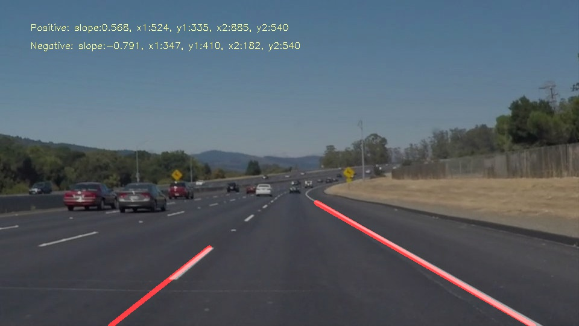
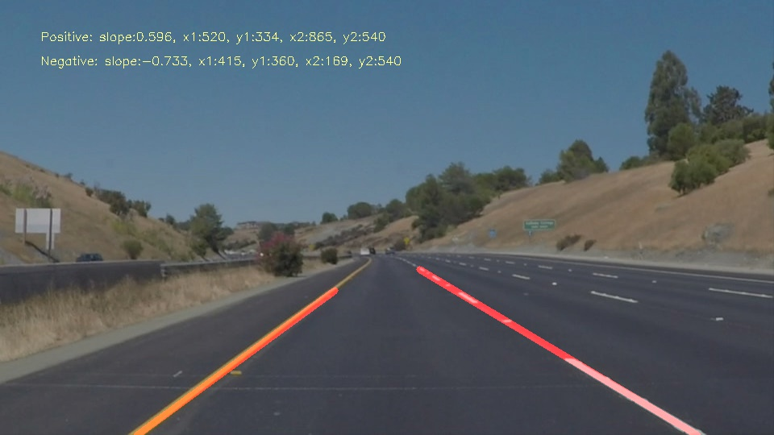
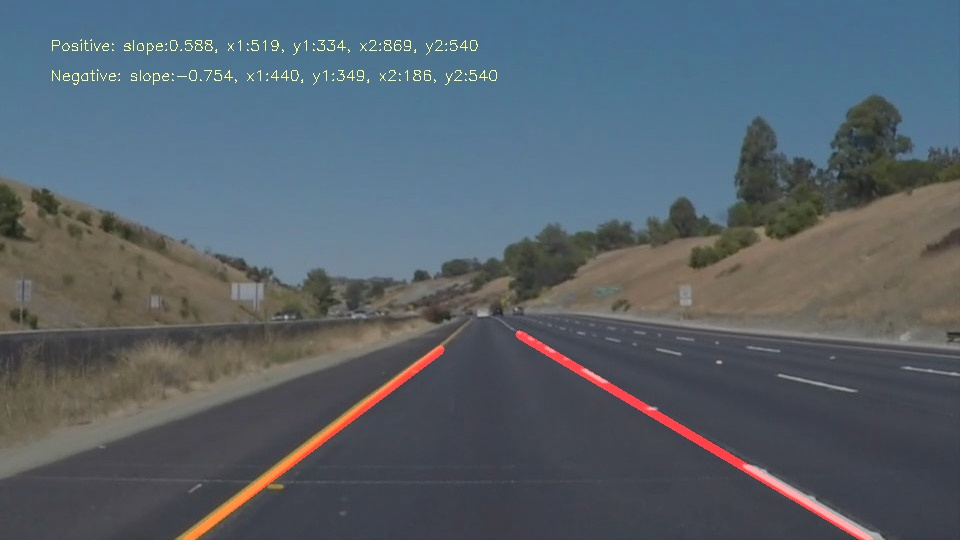

# Finding Lane Lines on the Road - Revision A

---

## Overview

When we drive, we use our eyes to decide where to go.  The lines on the road that show us where the lanes are act as our constant reference for where to steer the vehicle.  Naturally, one of the first things we would like to do in developing a self-driving car is to automatically detect lane lines using an algorithm.

---

### The goals / steps of this project are the following:

* Make a pipeline that finds lane lines on the road
* Reflect on your work in a written report

---

## Pipeline Approach 

### The pipeline uses of the following methods to capture the lanes: 

* Color Selection
* Region Masking
* Apply Canny Edges to idetify the lanes 
* Apply Hough Transform to only select the most relevant lanes and filter out the noisy - non relevant - lines

### The pipeline consists of the main following steps: 

* Bluring the input images using `gaussian_blur` function
* Identifying the edges using `canny` function. To specify the low and high threshold, I am using the mean and 1.33 times the mean of the bottom-half image. This way I get the mean of the road, potentially filtering the sky background out. 
* Identifying the region of interest by applying a mask with a trapezoid shape. The trapezoid shape mimics the perspective intuition of the meeting lanes. 
* Identifying the most relevant lanes out of all the captured ones using Hough transform thresholds. These thresholds are calibrated after some trial and errors to obtain the best results.

### More technical details and tricks I have used to improve the results

* in `draw_lines` function: 
  * I define two filtering tolerance variables, `horizontalSlopeTol` and `verticalSlopeTol`, to filter out close-tohorizontal and close-to-vertical lines. This helps remove some noisy lines. 
  * I distinguish between positive and negative slope lines. So the representative lines have slope by introducing two variables `avgPositiveSlope` and `avgNegativeSlope`. Accordingly, the captured lines are stored in `positiveSlopeLines` and `negativeSlopeLines` variables. 
  * The averaged / extended lines are defined using the slopes mentioned above. The averaged lines are `extendedPositiveSlopeLine` and `extendedNegativeSlopeLine`. 

* I got better results using the color -  original - images instead of using gray ones 

---

### Sample Videos

<!-- blank line -->
<figure class="video_container">
  <video controls="true" allowfullscreen="true" poster="test_images_output/solidWhiteCurve-lanes.jpg">
    <source src="test_videos_output/solidYellowLeft.mp4" type="video/mp4">
  </video>
</figure>
<!-- blank line -->

---

### Sample Screenshots

